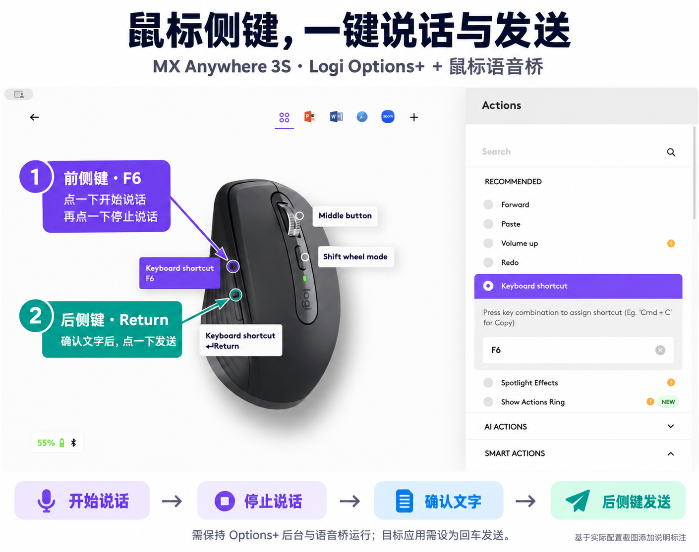

# User Guide · 鼠标语音桥使用教程

用鼠标侧键控制微信输入法：**前侧键点一下开始说话，再点一下结束；确认文字后，后侧键一按发送。**

[下载 App（v0.1.0）](https://github.com/zhsongqing/mouse-voice-bridge/releases/tag/v0.1.0) · [返回项目首页](README.md)

本教程适用于 v0.1.0 原型，更新于 2026-09-23。目前仓库为私有：请使用有仓库访问权限的 GitHub 账号登录后下载；看到 404 时先检查账号和访问权限。

## 一图看懂两个侧键

*图 1：基于实际 Logi Options+ 配置截图，使用 AI 图像编辑辅助添加中文标注。不是罗技官方教程；不同版本的界面文字可能不同。*

| 位置 | 在 Options+ 中设置 | 使用效果 |
| --- | --- | --- |
| 前侧键：靠近鼠标前端 | Keyboard shortcut → F6 | 第一次点击开始说话，第二次点击结束 |
| 后侧键：靠近手腕 | Keyboard shortcut → Return | 文字出现并确认后，按一下回车；目标应用设置为回车发送时即可发送 |

## 1. 使用前准备

- Apple Silicon Mac（M 系列芯片）；当前下载包没有验证 Intel Mac。
- 已连接的 Logitech MX Anywhere 3S 鼠标。
- 已安装并能识别鼠标的 Logi Options+。
- 已安装微信输入法，使用实体键盘按住 Fn 时可以正常语音输入。

已验证的组合是 MacBook Air 13 英寸、Apple Silicon、macOS 15.6.1、MX Anywhere 3S 蓝牙连接和微信输入法。其他组合尚未验证。电脑自带麦克风即可，鼠标不需要麦克风。

## 2. 从 GitHub 下载并打开 App

1. 打开 [v0.1.0 下载页面](https://github.com/zhsongqing/mouse-voice-bridge/releases/tag/v0.1.0)。页面标注 **Pre-release**，表示当前是预发布原型。
2. 展开页面下方的 **Assets**，下载 **`MouseVoiceBridge-v0.1.0-macos-arm64.zip`**。不要选 `Source code`，那是给开发者的源码压缩包。
3. 双击 ZIP 解压，得到 **MouseVoiceBridge.app**。
4. 建议将 App 放入“应用程序”文件夹，再打开它。后续授权和启动都选择这个固定位置的副本。

[直接下载 App ZIP](https://github.com/zhsongqing/mouse-voice-bridge/releases/download/v0.1.0/MouseVoiceBridge-v0.1.0-macos-arm64.zip)

### 如果 macOS 阻止首次打开

当前 App 只有本地临时签名，没有 Apple Developer ID 签名和公证。只有在确认下载来源可信时，才按系统提示继续：尝试打开一次后，进入 **系统设置 → 隐私与安全性**，查看是否出现该应用的 **仍要打开 / Open Anyway**，并由你本人确认。具体界面以系统版本为准，参见 [Apple 官方说明](https://support.apple.com/en-gb/102445)。

不要关闭整个系统的安全检查。如果没有对应选项或系统提示应用损坏，先停止操作，记录提示；也可以按 [README 的源码编译说明](README.md#从源码编译)在本机编译。

## 3. 配置 Logi Options+ 的两个侧键

对照上方图 1 操作：

1. 打开 Options+，选择 **MX Anywhere 3S**，进入按键配置。
2. 先选择全局配置（所有应用）。点击**前侧键**，动作选择 **Keyboard shortcut（键盘快捷键）**。
3. 用实体键盘录入 **F6**。本机使用 **Fn＋F6** 录入成功；以界面最后显示 `F6` 为准，不是输入字符“F”和“6”。
4. 点击**后侧键**，同样选择 Keyboard shortcut，按一次实体键盘回车，确认显示 **Return**。
5. 如果 Codex、浏览器或其他应用有专属配置，也检查该配置的侧键映射，避免覆盖全局设置。

配置完成后可以关闭 Options+ 设置窗口，但需要保留其后台服务。

## 4. 配置微信输入法

1. 打开微信输入法设置，进入 **语音输入**。
2. 开启 **按住说话**，将快捷键设为 **Fn**。
3. 按系统提示允许微信输入法使用麦克风。
4. 在空白文本框中，先用实体键盘按住 Fn 说一句话，松开后确认文字出现。

如果实体键盘这一步也不成功，先处理微信输入法的语音设置或麦克风权限。语音桥只负责触发，录音与识别仍由微信输入法完成。

## 5. 授权并启动鼠标语音桥

1. 打开 **MouseVoiceBridge.app**，看到“鼠标语音桥”窗口。
2. 点击 **启动**。首次使用可能提示授权。
3. 前往 **系统设置 → 隐私与安全性 → 辅助功能**，开启 **MouseVoiceBridge**。若没有该条目，点击 **＋**，选择第 2 步放好的 App。
4. 如果系统要求验证，使用 Touch ID 或 Mac 登录密码完成验证。
5. 回到语音桥，点击 **启动**。

**成功的判断标准：窗口显示“已启动，等待侧键或 F6”，原来的“启动”按钮变成“暂停”。**

启动前后应检查这三项：

| 窗口项目 | 推荐状态 |
| --- | --- |
| 模式 | 点按开关 |
| 输出 | HID |
| 监听状态 | 已启动，等待侧键或 F6 |

不用点击“识别侧键”，也不用点击“配置 Options+：5 秒后发送 F6”。它们是诊断／实验功能，不是当前推荐流程的必需步骤。

## 6. 第一次实际测试

1. 在文本编辑或其他应用中打开一个空白文本框，将光标放进去。
2. **点击前侧键一次**，确认微信语音面板出现，再说一句“测试鼠标语音输入”。
3. **再点前侧键一次**，结束说话，等待识别文字出现在文本框。
4. 确认文字正确后，在支持“回车发送”的聊天输入框中按后侧键发送。

> 前侧键停止录音并不自动发送。后侧键是回车：目标应用如果把回车设为换行，它就会换行。第一次测试时不要在重要消息或命令输入框中直接尝试发送。

语音桥显示“已发送 Fn”只代表发出了按键事件；以**微信语音面板出现、结束后文字进入输入框**作为实际成功标准。

## 7. 日常怎么用

**前侧键开始 → 说话 → 前侧键结束 → 等待并确认文字 → 后侧键发送。**

- 单次最长保持 60 秒，到时自动释放 Fn。
- 保持语音桥和 Options+ 后台运行。关闭语音桥窗口可以，点击“退出”会停止桥接。
- 当前版本不会自动开机启动。重新打开 App 后，需要点击“启动”。
- 电脑睡眠或用户会话停用后，监听会暂停；恢复使用时重新点击“启动”。
- 实体键盘 F6 也会触发语音桥，运行期间会被接管。
- 需要立即停止时，点击 **立即释放 Fn**；需要停止监听时点击 **暂停**。

## 8. 常见问题与排错

### A. 点“启动”总提示授权，但辅助功能开关明明开着

这是本机实际遇到并解决过的现象。单纯关闭再开启开关未能解决，**移除旧条目，再添加当前应用**后恢复了正常。具体底层原因尚未确认。

1. 退出鼠标语音桥。
2. 打开 **系统设置 → 隐私与安全性 → 辅助功能**。
3. 选中 **MouseVoiceBridge** 这一行，点击列表下方的 **－（移除）**。这只移除授权条目，不会删除 App。
4. 点击 **＋（添加）**，选择你当前实际使用的 **MouseVoiceBridge.app**，点击“打开”。例如，安装在“应用程序”时选择那里的副本，不要选择下载文件夹里的另一份。
5. 确认该条目的开关已开启。如提示 Touch ID 或密码，由你本人验证。
6. 重新打开同一个 App，点击 **启动**，确认显示 **已启动，等待侧键或 F6**。
7. 在空白输入框重新测试前侧键的开始和结束。

如果仍未恢复，记录系统版本、App 所在位置和窗口提示后反馈；不要反复重装或重置所有应用权限。重新编译或替换 App 后也可能需要重新授权。

### B. 已启动，但点鼠标没有任何反应

先看窗口中的 **收到触发：N 次** 是否增加：

| 观察结果 | 下一步 |
| --- | --- |
| 计数不增加 | 检查 Options+ 后台、前侧键是否为 F6、当前应用专属配置是否覆盖映射 |
| 实体 F6 能增加计数，鼠标不能 | 优先检查 Options+ 的鼠标映射；Mac 实体 F6 可能需要同时按 Fn |
| 计数增加，但没有微信语音面板 | 检查微信“按住说话”为 Fn、语音桥为点按开关＋HID，并让光标位于文本框 |
| 键盘按住 Fn 也不能语音输入 | 优先检查微信输入法、麦克风权限和语音设置 |
| 窗口显示已暂停或监听中断 | 重新点击启动，再测试 |

如需单独测试 Fn 输出，点击 **独立测试 Fn**，在 5 秒内将光标放入空白文本框；程序会保持 Fn 3 秒后释放。该测试不代表鼠标映射已经正常。

### C. 录音停不下来，或者 Fn 状态不对

点击 **立即释放 Fn**，必要时点击“暂停”。如果刚才强制结束了 App，可手动按下并松开实体 Fn，然后重新打开工具测试。

### D. 下载链接显示 404

本仓库目前为私有。请登录获得仓库访问权限的 GitHub 账号；仅转发链接不会自动赋予访问权限。若已经能打开仓库，再进入 Releases 查看附件。

## 9. 权限和数据说明

语音桥不采集音频、不保存输入文本、不访问网络。辅助功能权限用于监听并转换输入事件，属于较广泛的系统权限；可以在系统设置中撤销。语音识别使用微信输入法自身的服务和隐私设置。

当前版本是个人实用原型。按住模式、原始侧键识别和 Session 输出仍属实验选项；本教程采用已经手动验证的 **F6 → Fn、点按开关、HID** 配置。

---

[下载 App](https://github.com/zhsongqing/mouse-voice-bridge/releases/tag/v0.1.0) · [项目说明与源代码](README.md)
